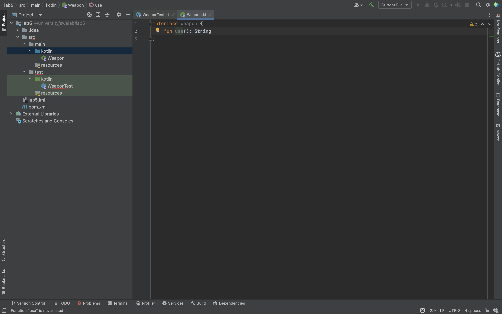

# SWE Lab 5

Ahmad Salimi - 97106013

## Report

### Abstract Factory pattern

#### Write the tests

We face compile error because the classes are not implemented yet.

#### Implement the `Weapon` interface

#### Implement the `WeaponFactory` abstract class

#### Implement the `Crossbow` class having `Factory` companion object

#### Implement the `Katana` class having `Factory` companion object

#### Run the tests

### Prototype pattern

#### Write the tests

We face compile error because the classes are not implemented yet.

#### Implement the `ReportItemPrototype` interface

#### Implement the `TextItem` class

#### Implement the `ImageItem` class

#### Run the tests

### Builder pattern

#### Write the test

We face compile error because the classes are not implemented yet.

#### Implement the `FoodOrder` class, having a builder member

#### Run the test

## Answers to the questions

1. There have been introduced three classes of design patterns in the "Gang of Four" book. name them and explain each in 2 lines.

    - Creational Patterns: These patterns deal with object creation mechanisms, trying to create objects in a manner suitable to the situation. Example patterns include Factory Method, Abstract Factory, and Singleton.

    - Structural Patterns: These patterns deal with object composition, creating relationships between objects to form larger structures. Example patterns include Adapter, Bridge, and Decorator.

    - Behavioral Patterns: These patterns focus on communication between objects, what goes on between objects and how they operate together. Example patterns include Observer, Iterator, and Command.

1. What category do the three used patterns belong to?

    All three belong to the Creational Patterns category.

1. What are the main differences between SOLID and patterns introduced in "Gang of Four"?

    SOLID refers to a set of five design principles for writing maintainable and scalable software. These principles are: Single Responsibility Principle, Open/Closed Principle, Liskov Substitution Principle, Interface Segregation Principle, and Dependency Inversion Principle. SOLID provides a set of guidelines for designing software that is easy to change, maintain, and extend over time.

    Design patterns, on the other hand, are reusable solutions to common problems that arise in software design. The "Gang of Four" book introduced three main categories of design patterns: Creational, Structural, and Behavioral. Design patterns provide a way to capture and reuse proven solutions to design problems in a structured and repeatable way.

1. Which SOLID principle does the Singleton pattern violate?

    While the Singleton pattern is a popular and widely used pattern, it can violate the Single Responsibility Principle (SRP) of SOLID.

    The Single Responsibility Principle states that a class should have only one reason to change. A class that implements the Singleton pattern may have multiple responsibilities, as it has to manage its own creation and ensure it has only one instance. This can lead to tight coupling and make the class harder to maintain and test, as changes to the Singleton class can have wide-ranging effects on the rest of the system.
